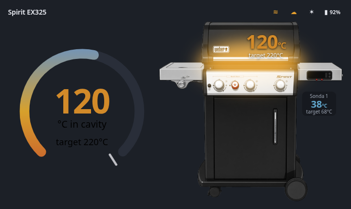

# Weber Grill Card

[![hacs][hacs-badge]][hacs-url] [![release][release-badge]][release-url]

Lovelace card for a Weber grill: cavity temperature, probes, connectivity and
cook-session alerts. Built for the entities published by
[weber-bridge](https://fg.iwanus.eu/jiwanus/grill-weber), but every entity is
configurable — any temperature source works.

🇵🇱 [Polska wersja tego pliku](README.pl.md)



## Features

- **Gauge and grill side by side** — the cavity temperature reads on a 270° gauge
  and again on the grill's lid, where you'd look for it.
- **The cook box glows** blue when cold, yellow while warming, red when hot. The
  three colours and both thresholds are editable.
- **Real product artwork** — photo render or flat vector, switchable.
- **Probes** with target and progress; a probe at or past its target is marked.
- **Alert banner** from the bridge's alert entity, auto-hiding after a set time.
- **Status chips** — WiFi, cloud, Bluetooth, battery; each opens more-info.
- **Offline handling** — the card dims and says so instead of presenting a stale
  number as current.
- **Five looks**, one option apart: `thermo`, `artwork`, `compact`, `ring`,
  `type` — with photo or vector artwork under each of them.
- **Polish and English**, following Home Assistant's language or pinned per card.

## Install

### HACS

1. HACS → three-dot menu → **Custom repositories**
2. Repository `https://github.com/jrx-code/weber-grill-card`, type **Dashboard**
3. Install, then reload the browser.

HACS downloads the whole `dist` directory, so the artwork arrives with the card.

### Manual

Copy the contents of `dist/` (the `.js` **and** both `.png` files) to
`/config/www/weber-grill-card/`, then add a Lovelace resource
`/local/weber-grill-card/weber-grill-card.js` of type **module**.

Either way the card finds its artwork on its own — the image base is derived from
where the script was loaded from, so `/hacsfiles/…` and `/local/…` both work
unconfigured. Set `image_base` only if you move the files apart.

## Configuration

Everything is editable in the GUI: entity pickers (including one per probe), the
look, on/off switches, glow colours with thresholds, a slider per layout
coordinate, and centre / reset shortcuts. YAML below is what the editor writes.

```yaml
type: custom:weber-grill-card
name: Spirit EX325
variant: thermo          # artwork | compact | ring | type
artwork: photo           # photo | vector
language: auto           # auto | pl | en
cavity_temp: sensor.spirit_ex325_temperatura_komory
cavity_target: sensor.spirit_ex325_cel_komory
battery: sensor.spirit_ex325_bateria
wifi: binary_sensor.spirit_ex325_wifi
cloud: binary_sensor.spirit_ex325_chmura
bluetooth: binary_sensor.spirit_ex325_bluetooth
last_alarm: sensor.spirit_ex325_ostatni_alarm
probes:
  - name: Probe 1
    temp: sensor.spirit_ex325_sonda_1
    target: sensor.spirit_ex325_sonda_1_cel
```

### Options

| option | type | default | meaning |
|---|---|---|---|
| `name` | string | `Grill` | label above the artwork |
| `title` | string | — | card header (omit for none) |
| `variant` | string | `thermo` | look; photo vs. vector is `artwork`, not a look |
| `artwork` | string | `photo` | `photo` or `vector` |
| `language` | string | `auto` | `auto` follows Home Assistant |
| `cavity_temp` / `cavity_target` | entity | — | cavity temperature and target |
| `battery` | entity | — | battery percentage |
| `wifi` / `cloud` / `bluetooth` | entity | — | connectivity chips |
| `last_alarm` | entity | — | alert sensor (state = title, attrs `text`, `when`) |
| `probes` | list | `[]` | `{name, temp, target}` per probe |
| `show_gauge` / `show_artwork` | bool | `true` | halves of the `thermo` look |
| `show_glow` / `show_probe_overlay` | bool | `true` | glow, probe chip on artwork |
| `show_status` | bool | `true` | status chips |
| `animate` | bool | `true` | smoke animation |
| `alarm_minutes` | number | `30` | hide the alert banner after N minutes (0 = never) |
| `glow_cold` / `glow_warm` / `glow_hot` | colour | blue / yellow / red | glow colours |
| `glow_warm_at` / `glow_hot_at` | number | `90` / `200` | °C thresholds between them |
| `layout` | object | see below | placement, in % of the artwork |
| `unit` | string | `°C` | displayed unit |
| `image_base` | string | derived | where the artwork lives |

### `layout`

All values are percentages of the artwork box, so they hold regardless of card
width. Defaults were measured on the artwork: the lid spans x 22–78%, y 0–25%,
and the lid seam sits at 26%.

| key | default | key | default |
|---|---|---|---|
| `ring_w` | 44 | `img_scale` | 100 |
| `cavity_x` | 58 | `cavity_y` | 13 |
| `cavity_size` | 85 | `probe_x` | 87 |
| `probe_y` | 46 | `probe_size` | 100 |
| `glow_x` | 50 | `glow_y` | 24 |
| `glow_w` | 58 | `glow_h` | 26 |
| `glow_blur` | 16 | | |

## Credits

Artwork: Weber Spirit EX-335 product render and vector, supplied by the user.
Weber and Spirit are trademarks of Weber-Stephen Products LLC; this project is
not affiliated with or endorsed by Weber.

[hacs-badge]: https://img.shields.io/badge/HACS-Custom-41BDF5.svg
[hacs-url]: https://github.com/hacs/integration
[release-badge]: https://img.shields.io/github/v/release/jrx-code/weber-grill-card
[release-url]: https://github.com/jrx-code/weber-grill-card/releases
